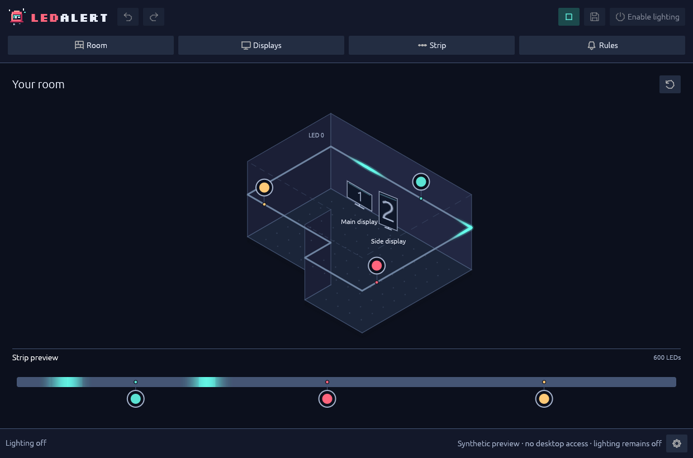

#  LedAlert

**Your notifications, in the room.** LedAlert is a native Windows 11 and Linux workbench for routing desktop notifications and media playback to spots of light on a WLED RGB strip. Draw the room, place your displays, map the strip — then watch each application claim its place.

[](https://github.com/CritX-ai/LedAlert/releases/tag/v0.3.0-alpha) [](https://crates.io/crates/ledalert) [](https://github.com/CritX-ai/LedAlert/actions/workflows/verify.yml) [](https://alert.critx.ai/#license-status)

---

[](docs/site/assets/screenshots/notifications.mp4)

*The native app: colors spread from each application's assigned LEDs. [Watch the notification preview](docs/site/assets/screenshots/notifications.mp4).*

## Install

**Try 0.3.0-alpha:** this [GitHub prerelease](https://github.com/CritX-ai/LedAlert/releases/tag/v0.3.0-alpha) adds Windows 11 support alongside Linux. It is not the stable/latest release and is **not published to crates.io**.

**Windows 11:** download the [portable ZIP](https://github.com/CritX-ai/LedAlert/releases/download/v0.3.0-alpha/ledalert-0.3.0-alpha-windows-x86_64.zip) and [checksums](https://github.com/CritX-ai/LedAlert/releases/download/v0.3.0-alpha/SHA256SUMS). The accompanying [MSIX](https://github.com/CritX-ai/LedAlert/releases/download/v0.3.0-alpha/ledalert-0.3.0-alpha-windows-x86_64.msix) is **unsigned, for development only**; there is no production signed installer yet. The [Windows installation steps](docs/guide/install.md#windows-11) explain checksum verification and explicit Developer Mode registration of the ZIP's manifest for notification access. Do not bypass signature checks or add certificate trust. Unregistered portable installs support the editor, taskbar, displays, media and lock detection, but cannot observe Windows notifications.

**Stable Cargo release:** with [Rust](https://rustup.rs/) and the [native dependencies](docs/guide/install.md#native-dependencies) installed:

```sh
cargo install ledalert --locked
```

This unversioned command selects the stable published crate, **not 0.3.0-alpha**. [cargo-binstall](https://github.com/cargo-bins/cargo-binstall#installation) likewise uses the published crate's binary metadata and available targets:

```sh
cargo binstall ledalert --strategies crate-meta-data
```

For the alpha on Linux, [download its archive](https://github.com/CritX-ai/LedAlert/releases/download/v0.3.0-alpha/ledalert-0.3.0-alpha-linux-x86_64.tar.gz) and the same release's checksums, then [verify and extract](docs/guide/install.md#download-a-release-bundle). To compile the alpha, [build from the `v0.3.0-alpha` source](docs/guide/install.md#build-from-source).

## Quickstart

1. [Draw the room](docs/guide/room.md). Start with a rectangle; **Room shape…** handles L-shapes later.
2. [Place your displays](docs/guide/displays.md). Import Windows or KDE geometry, or arrange them by hand.
3. [Map the strip](docs/guide/strip.md). Trace the route and LED order, then set the WLED address.
4. [Add rules](docs/guide/rules.md). Try examples and on-screen demos first — no hardware needed.
5. **Finish** saves the setup. [Enable lighting](docs/guide/operations.md#choose-whether-to-enable-real-lighting) whenever you're ready.

## Compatibility

Your desktop and your lights decide whether LedAlert fits. The short version:

| Your desktop | Status |
| :--- | :--- |
| <span class="platform-mark"></span> **Windows 11 x64** | Alpha |
| <span class="platform-mark"></span> **KDE Plasma / Wayland** | Supported |
| <span class="platform-mark"></span> KDE Plasma / X11 | Unverified |
| <span class="platform-mark"></span> GNOME | Unverified |
| <span class="platform-mark"></span> Xfce | Unverified |
| <span class="platform-mark"></span> Cinnamon | Unverified |
| <span class="platform-mark"></span> Other Linux desktops | Unverified |
| <span class="platform-mark"></span> macOS | Unsupported |

- **Windows 11:** native display discovery, actual taskbar pins, media and lock detection. Notifications require registered package identity and allowed notification-listener access. See [Windows verification and remaining manual checks](docs/windows-verification.md).
- **KDE Plasma on Wayland:** Linux x86_64 display discovery, pinned-app suggestions, notifications, lock detection and media markers.
- **Other Linux sessions:** KDE on X11 runs as a normal X11 client, but full integration is unverified. GNOME uses standard notification/lock services and manual display placement. Xfce and Cinnamon remain unverified; MATE, Budgie, LXQt and other desktops use the same standard services without verified integration.
- **macOS:** no desktop backend is available in this alpha. The planned beta adds macOS support and verification; final 0.3.0 follows cross-platform polishing. These are plans, not current capabilities.

| Your lights | Status |
| :--- | :--- |
| One WLED RGB strip | Supported |
| Multiple controllers or runs | Unsupported |
| Matrices | Unsupported |
| RGBW/CCT output | Unsupported |
| Other controller protocols | Unsupported |

Use one controller and one continuous strip path mapped in your room, up to **8,192 RGB LEDs**. Output is RGB to WLED only; this does not provide RGBW/CCT-specific control.

The Linux binary needs **glibc 2.36 or newer**, a graphical session, session D-Bus and working OpenGL/EGL. Per-feature details and the tested baseline: [Compatibility](docs/support.md). Your setup is not listed? See the [roadmap](docs/roadmap.md#future-directions) for where support is headed and the [contribution policy](docs/roadmap.md#contribution-policy) for how to land it — verified additions from real environments are exactly what we want.

## Lighting permissions

**Lighting starts disabled on every launch.** Connecting to WLED is read-only, but contacts the device. [Enable lighting](docs/guide/operations.md#choose-whether-to-enable-real-lighting) grants session-only permission; demos and **Preview** then reach the strip too. **Guide with real lights → Take control** is separate consent for whole-strip mapping, capped at two minutes and 25/255 per RGB channel. Neither permission is saved.

- **Minimize** keeps LedAlert running; **Close** stops it. No hidden daemon, no tray-only mode, no automatic startup.
- Lock and **Quiet mode** inhibit output. Notifications received while inhibited are discarded, not replayed.
- WLED HTTP/DDP is unauthenticated — use one controller on a trusted LAN. Releasing control does not guarantee darkness; recovery from a crash or network loss depends on WLED's realtime timeout.
- Brightness limits cap RGB data, not electrical power. LedAlert is ambient awareness, not a safety alarm. **Reduced motion** gives steady indications instead of fades and ripples.

LedAlert does not retain notification text or song metadata, capture audio, or read screen content. See [privacy details](docs/reference-runtime.md#desktop-integration-and-privacy).

## Field manual

[Install](docs/guide/install.md) · [Room](docs/guide/room.md) · [Displays](docs/guide/displays.md) · [Strip](docs/guide/strip.md) · [Rules](docs/guide/rules.md) · [Everyday controls](docs/guide/operations.md) · [Troubleshooting](docs/guide/troubleshooting.md)

[Compatibility](docs/support.md) · [Technical reference](docs/reference.md) · [Windows verification](docs/windows-verification.md) · [Roadmap and contributing](docs/roadmap.md) · [Release notes](RELEASE.md) · [Changelog](CHANGELOG.md) · [Security reporting](SECURITY.md)

The field manual is built with [ReGen](https://regen.critx.ai/).

## License status

LedAlert is dual-licensed under the [MIT License](LICENSE-MIT) or [Apache License 2.0](LICENSE-APACHE), **at your choice** (`MIT OR Apache-2.0`). Third-party components retain their own licenses, supplied in bundle notices and license texts. The bundled font's [SIL Open Font License](assets/fonts/OFL.txt) applies to that font only.

