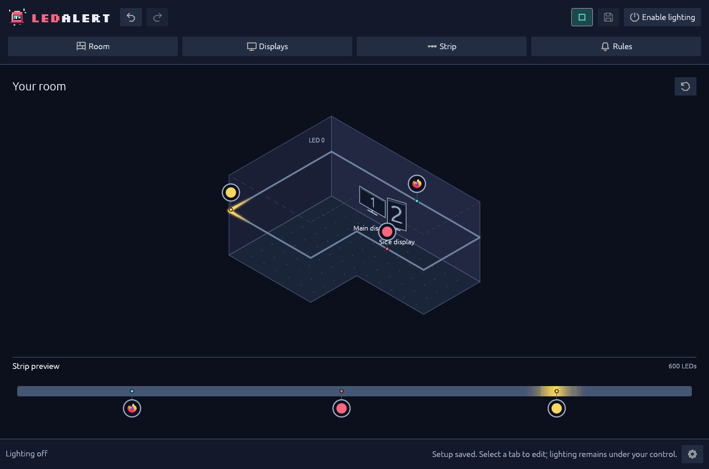

# Everyday controls

Your saved room is a plan, not permission to control a strip. Each launch starts with **lighting disabled**, even when LedAlert restores a finished setup and connects to WLED read-only.

## Choose whether to enable real lighting

Stay with [local rule demos](rules.md#preview-on-screen) to explore without hardware permission. When you want physical output:

1. Confirm the WLED address, reported LED count, strip route and rule destinations. Use a trusted LAN; stop other realtime controllers through their own controls.
2. Check **Settings → Integration status**. The session must be observed as unlocked, **Quiet mode** must be off and the setup must be valid.
3. Set a low **Strip → Alert brightness**. This caps RGB data, not measured power or light output; WLED's own current limit still matters.
4. Select **Enable lighting**. This session-only permission also makes **Demo rule**, **Demo all** and toolbar **Preview** drive the real strip.
5. Start a fresh demo to see the result: changing lighting enablement clears existing demos and active notification records.

**Try examples** is always local-only. **Guide with real lights → Take control** grants separate, temporary permission for mapping the entire strip. It suspends normal alerts and does not automatically re-enable them afterward. Read [physical LED guidance](strip.md#optional-identify-physical-leds) before using it.

**Disable lighting** stops normal output and asks an acquired device to leave realtime mode. WLED decides what resumes: release does not guarantee darkness or restoration of an earlier effect.

## Understand pauses and resets

| Event | What to expect |
| --- | --- |
| Valid same-device edit, selection or undo/redo | Your current lighting choice stays in effect. Editing does not automatically disarm output. |
| Invalid draft, **Quiet mode**, session lock or unavailable/stale lock state | Output pauses, retaining the enablement choice. Resolving the condition can resume eligible output. New notifications received while paused are discarded. |
| Device address or LED count changes | Output is disarmed. Review the device and allocation before granting permission again. |
| Edit, inhibition, fault or guidance stops a demo | The demo does not restart automatically. |
| Notification observation is lost or its daemon restarts | Tracked persistent lights clear and are not reconstructed. |
| LedAlert restarts | Lighting permission, guidance, demos, notification records and undo steps are not restored. |

Existing persistent notifications can resume after lock/quiet inhibition. Popup timeout alone does not clear them: desktop closure/dismissal or LedAlert's local **Dismiss** ends the light. Local dismissal does not dismiss the desktop notification.

If output fails, do not repeatedly attempt acquisition after uncertain release. A read-only observation must establish that the previous device is no longer live. Crash, network loss and forced termination rely on WLED's existing realtime timeout; LedAlert does not change it or guarantee a recovery interval.

## Save, finish and return

- **Save** or **Ctrl+S** writes a valid configuration. Invalid settings cannot overwrite the last valid save.
- **Finish** saves and hides the sidebar. It does not enable lighting. Select a top tab to edit again.
- The finished view places application markers at their LED anchors; overlapping markers show a count and an inspectable application list.
- **Settings → Replay setup guide** replays the guide without clearing your setup.

On later launches, an eligible saved target is checked read-only with lighting off. Failure opens **Strip** with the error and a retry action.

[](../site/assets/screenshots/overview.png)

## Minimize, close or reduce motion

**Minimize** keeps notification and inhibition processing running. **Close** stops LedAlert, offering save/discard/cancel for unsaved changes. There is no hidden daemon, tray-only mode or automatic startup installation.

In **Settings**:

- **Reduced motion** replaces fades/ripples with steady indications and stops decorative movement, without changing notification lifetime.
- **Hide tooltips** hides hover explanations; icon buttons keep accessible names.
- **Hide demo content** hides examples and stops demo playback.

These preferences survive restart.

## Undo and redo

**Undo / Redo** and **Ctrl+Z / Ctrl+Shift+Z** cover room, strip, rules, settings and the address draft, up to **64 steps**. Drags and continuous edits are grouped. A new edit after undo starts a new branch; no-op edits keep redo available.

Text fields keep native shortcuts. Leave the field or use toolbar controls for whole-editor undo. Camera orbit is not a configuration edit.

Undo/redo never grants permission or restores quiet/lock state or notification records. Same-device changes preserve current connection and enablement; a target change disarms output. Guidance always ends on undo/redo.

## Find and back up your setup

The default configuration is `$XDG_CONFIG_HOME/ledalert/config.json`, or `~/.config/ledalert/config.json` when `XDG_CONFIG_HOME` is unset. The preferences sibling is `config.json.ui.json`. A custom `--config /path/to/config.json` uses that file and `/path/to/config.json.ui.json`.

The configuration stores room, routing and device settings. Preferences store guide/completed-view state, strip placement, the last successfully connected saved target and tooltip/demo visibility. Neither stores lighting permission, guidance consent or notification records.

**Close LedAlert before copying or restoring these files.** Keep separate known-good backups. Configurations can contain private device addresses and application identities; do not attach a personal setup to a public issue.

If a setup cannot be read, preserve the file and inspect the error. Opening the error screen leaves it unchanged, but **Begin new setup** followed by saving replaces it. Do not use that action as a diagnostic reset.

## Run bounded diagnostics

From an extracted binary bundle:

```sh
./bin/ledalert --config /path/to/config.json check-config
./bin/ledalert --config /path/to/config.json probe
./bin/ledalert --help
```

`check-config` validates the file without desktop or network access. `probe` is read-only **but contacts the configured device**. Neither enables lighting. Use the source-build executable path, or `ledalert` if installed on PATH.

For storage details, see [Saved setups and diagnostics](../reference-configuration.md#configuration-and-diagnostics). For a visible failure, use [Troubleshooting](troubleshooting.md).
