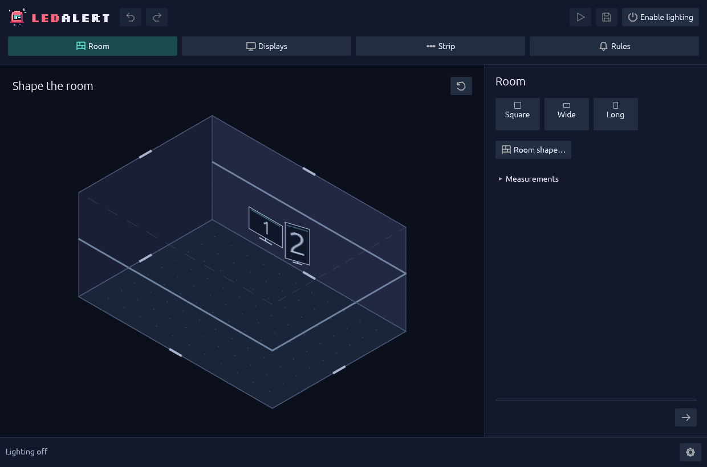
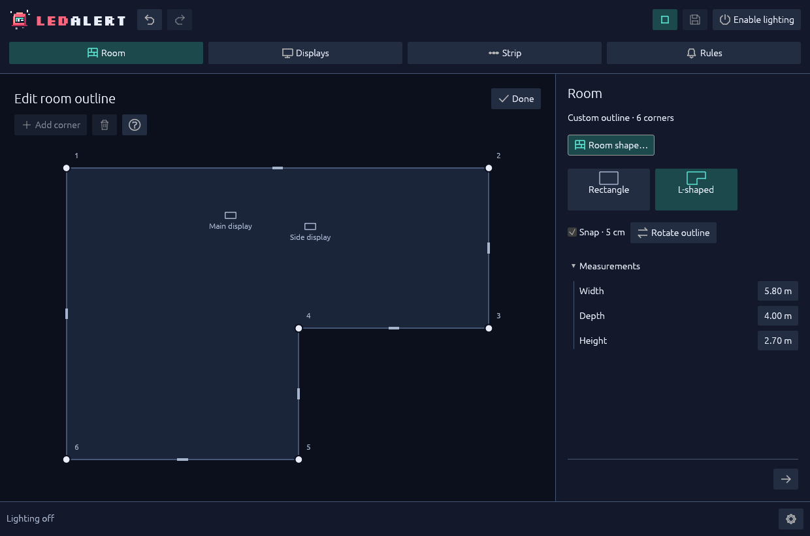

# Draw the room

Start with a rectangle, then shape it around your setup. The room is a map for notification positions—not automatic calibration or a simulation of light through walls.

## Start with the rectangle

1. Open **Room**. Rectangular editing is the default; there is no need to open the outline editor for an ordinary room.
2. Choose **Square**, **Wide** or **Long** for a starting proportion, or drag the bounding floor edges to adjust width and depth.
3. Drag the upper edges for height. For exact values, expand **Measurements** and enter **Width**, **Depth** and **Height**.
4. Middle-drag to orbit the view; the reset-view control restores the camera. Neither changes the setup.

*Start with a rectangle and adjust its proportions.*

Measurements use **meters (`m`)**, with room dimensions from **0.5 to 50 m**. Both `3.75` and `3,75` work; do not mix separators or use thousands grouping. Press **Enter** or leave a field to commit. Display rounding does not change saved geometry. Consistent proportions are enough to begin.

## Choose an outline only when you need one

For an L-shaped room or a custom footprint:

1. Select **Room → Room shape…**. This opens the optional top-down editor.
2. Choose **Rectangle** or **L-shaped** as a starting outline.
3. Drag a corner dot or the middle grip of a wall. **Snap · 5 cm** is available; clear it for finer movement.
4. Select a corner to reveal **Across / Along** measurements. **Add corner** inserts a corner on its outgoing edge; the trash action removes the selected corner.
5. Use **Rotate outline** to turn the footprint within its existing width/depth box.
6. Select **Done** to return to the 3D workbench. This closes advanced editing; it does **not** save or enable lighting.

*Use the top-down editor for corners and walls.*

Custom outlines have **3–12 corners** and a uniform height. Keep adjacent corners at least **1 cm** apart. Self-intersections, overlapping edges and holes are invalid. There are no internal partitions, multiple rooms or curved walls.

## Know what an edit moves

| Your action | What happens to the existing setup |
| --- | --- |
| Change **Width / Depth / Height**, drag room-size edges, or choose rectangle proportions | Room resizing scales placement proportionally and preserves LED allocation indices. |
| Change only the outline, including **Rotate outline** | Display anchors, strip points, LED allocation and rule anchors stay where they were. Nothing is silently fitted to the new footprint. |
| Choose **Strip → Starting placements → Around room**, or apply an **Along walls** route | Explicitly replaces the strip path using the current perimeter and resets its allocation. Review direction and allocation afterward. |

If the strip follows new walls, [replace its route](strip.md#choose-or-replace-the-route). **Undo** restores the previous route and allocation.

## Resolve red spans before saving

A new outline can leave existing placements outside the room. Red spans and the conflict count identify the problem:

- Move the affected display anchor or strip points back inside.
- Add a bend where a strip span would cut across a concave corner. The **whole span**, not just both endpoints, must remain inside the footprint.
- Adjust the outline to include the existing placement, or use **Undo**.

Display containment checks the display's floor anchor; it is not a calibrated enclosure check for every part of a physical monitor.

Invalid drafts pause output and cannot overwrite a valid save. If lighting is enabled, a valid same-device correction can resume output; editing is not a disarm. Missed notifications are discarded. Leave lighting disabled for local-only editing.

Corner and edge drags each form one undo step. Use **Undo / Redo** or **Ctrl+Z / Ctrl+Shift+Z**; leave a text field first when you want whole-editor history rather than text editing.

## Save and continue

Use **Save** or **Ctrl+S** to save the valid setup. **Finish** also saves and opens the finished view without granting lighting permission; select a top tab to edit again.

Next: [Place displays](displays.md). For exact bounds and storage semantics, see [optional room outlines](../reference-editing.md#optional-room-outlines) and [configuration](../reference-configuration.md#configuration-and-diagnostics).
