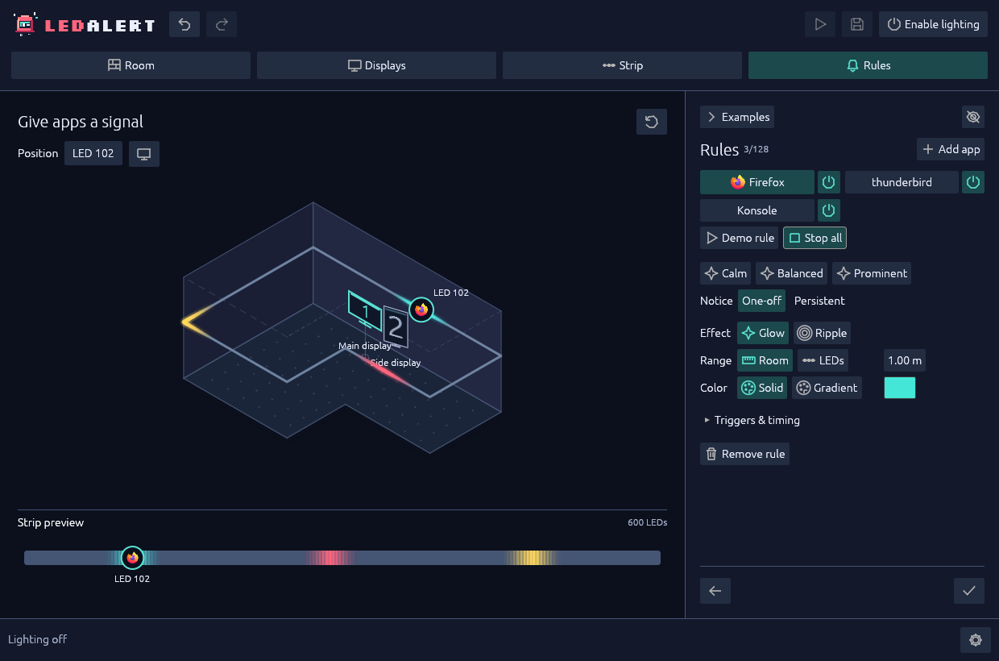

# Create rules

Give each application a destination, a color and a lifetime. Start with one rule you can recognize, then add reinforcements.

**Demo rule**, **Demo all** and toolbar **Preview** play on screen; they also drive the real strip whenever lighting is enabled. **Try examples** is always local-only.

## Add an application

Open **Rules**. You have two starting paths:

### Try taskbar suggestions

**Examples** reads Plasma's pinned launchers and desktop-entry metadata. Communication and productivity apps are initially selected; you can include other pins.

1. Choose the applications you want to try and a display for their initial destination.
2. Select **Try examples** to cycle through them locally. The status bar names the current app. This does not add rules, launch applications or send pixels.
3. Select **Add selected** to add only missing explicit rules in one undoable edit. Existing rules and the fallback stay intact.

Examples last three seconds, without media or critical emphasis. New rules take the icon's dominant color, or a category color; saved colors stay unchanged. Collapse **Examples**, or use **Settings → Hide demo content** to hide it and stop playback.

### Use an observed or exact application ID

Select **Add app**, then choose a recently observed source or enter its exact **Application ID** and press **Enter** or the create-rule **+** control. Let the application emit a normal desktop notification if you need its observed identity to appear.

Launcher names can differ from notification identities. Matching uses the canonical `desktop-entry` prefix before the app name and is exact, ignoring ASCII case. Choose an observed ID rather than guessing or stripping a legitimate `.desktop` suffix.

**All other apps** is the `*` fallback. With no rules, **Use a simple default** creates it. An explicit rule that is disabled or rejects a trigger **suppresses fallback for that application**; fallback is not a second chance after a filtered rule.

## Place the signal

1. Select the application's tile to edit it. The separate power icon turns the rule on or off; selecting a tile does not toggle it.
2. Click a room display to assign the rule to it. By default, the marker follows that display's mapping to the strip.
3. To choose a fixed device LED, drag the round marker along the strip in either the room or the bottom LED view. Use contextual **Position** for an exact index.
4. Use the display icon to return to following the assigned display.

Both views show the same anchor. Explicit LED positions survive geometry, allocation and direction changes; changing LED count scales them proportionally. Removing a display redirects its rules to the first remaining display, so review those destinations afterward.

*Give each application a destination and an effect.*

## Choose the lifetime first

| Choice | When the indication ends |
| --- | --- |
| **One-off** | After its finite duration. Selecting this mode enables fading. |
| **Persistent** | When the desktop explicitly dismisses/closes the notification, or you dismiss its light in LedAlert. Popup timeout alone does not clear it. |

Scene **Dismiss** clears the selected rule's persistent lights; the toolbar dismissal counter clears all. Neither dismisses desktop notifications. Persistent lights are not restored after restarting LedAlert.

## Shape the effect

**Calm**, **Balanced** and **Prominent** set duration, reach and intensity while keeping the application, triggers and color. Refine from there:

- **Glow** gives a centered indication; **Ripple** adds one outward band. Effects do not repeat or strobe. A persistent ripple enters once over a steady marker.
- **Room** range uses three-dimensional distance from the anchor LED. **LEDs** range uses device-index steps, independent of drawing scale. Both extend outward on either side of the anchor.
- **Solid** uses one color. **Gradient** uses two to eight stops from the center to the outer range. Endpoints stay at 0% and 100%; intermediate stops can move or be removed.
- **Triggers & timing** exposes **Notifications**, **Media**, minimum **Urgency**, **Critical accent**, **Duration** or **Entrance**, **Intensity**, and **Fade in and out**.

For a steady finite indication, choose **One-off → Glow** and clear **Fade in and out**. **Settings → Reduced motion** takes precedence over fades and ripples, substituting steady indications without changing their lifetime. Playback markers remain steady.

Overlapping signals add RGB contributions before a shared per-LED brightness limit. Red and blue can mix toward magenta; dismissing one signal leaves the other.

<figure>
  <video controls muted loop playsinline preload="none" poster="../site/assets/screenshots/overlap.png" aria-label="Overlapping notification effects mixing colors along LedAlert's mapped LED strip">
    <source src="../site/assets/screenshots/overlap.webm" type="video/webm">
    <source src="../site/assets/screenshots/overlap.mp4" type="video/mp4">
    <a href="../site/assets/screenshots/overlap.mp4">Watch the overlapping notification preview</a>.
  </video>
  <figcaption>Notification effects combine their colors as they spread along the strip.</figcaption>
</figure>

## Preview on screen

1. Use **Demo rule** to inspect the selected rule's position and appearance. One-off demos expire; persistent demos toggle off with the same button. Selecting another rule stops them.
2. Use **Demo all** to start eligible notification rules together, including an explicit fallback. Disabled or notification-filtered rules do not play. Toggle it off, select a single rule, or leave/hide the Rules sidebar to stop persistent demos.
3. Select **Finish** to save a valid setup. In the finished view, toolbar **Preview** cycles eligible rules in shuffled order with random **1–5 second** gaps. Click it again, press **Esc** or select a rule to stop.

Stopping a demo never dismisses a real notification; configuration edits, lock/quiet inhibition, output faults and guidance stop demos, and recovery does not restart them. Changing lighting enablement clears them too.

On-screen colors are lifted so low-brightness signals remain visible; they do not predict measured room brightness.

When you choose to move beyond preview, follow [the explicit lighting-permission steps](operations.md#choose-whether-to-enable-real-lighting). Check **Settings → Desktop notifications** and the rule's **Notifications** trigger and urgency filter. Only supported desktop notifications are observed; in-app messages and other transports do not automatically qualify.

For a playback marker, enable **Settings → Media playback** and the rule's **Media** trigger. The application must expose participating MPRIS playback state; notification support does not imply media support. LedAlert does not capture audio or read track metadata.

If a demo works but a real event does not, start with [notification troubleshooting](troubleshooting.md#a-demo-works-but-desktop-notifications-do-not). See [rule behavior](../reference-editing.md#rules-effects-and-palettes) for coalescing and capacity limits.

Next: [Everyday controls](operations.md).
