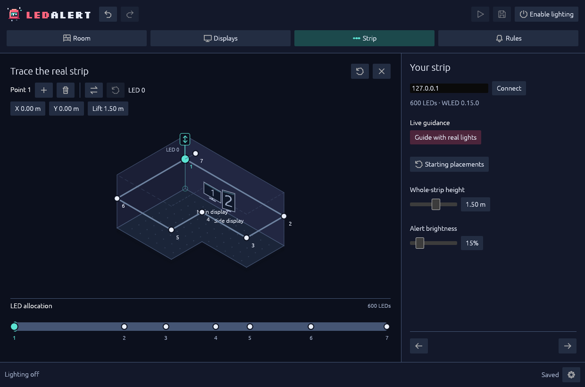

# Map the strip

The drawing says where the strip runs. LED allocation says which physical LED belongs at each bend. Get those two maps aligned before asking the photons to report for duty.

You can edit the path without connecting hardware. **Connect** reads a device; it does not send pixels. **Guide with real lights** is different: it requests temporary control of the entire strip.

## Connect read-only

Use a configured WLED RGB device on a trusted local network:

1. Open **Strip**.
2. Replace **WLED IPv4 address** with your device's private LAN or link-local IPv4 address. The initial `127.0.0.1` is local loopback, not a discovered strip.
3. Select **Connect**. LedAlert reads the LED count, WLED version and realtime state without changing settings or sending pixels.
4. Review the reported count. A changed count disarms output and requires allocation review; connecting is not permission to light.

If **Another realtime source is active** appears, stop that controller through its own controls, then reconnect. LedAlert refuses takeover; WLED HTTP/DDP has no authenticated, exclusive ownership.

Allow HTTP **80** for the JSON API and UDP **4048** for DDP. A read-only connection checks HTTP, not physical light or UDP delivery.

## Choose or replace the route

Starting placements are shortcuts, not a continuing attachment to the walls:

- **Around room** replaces the strip with the current room perimeter.
- **Along walls** lets you click adjacent walls in the order followed by the real strip. Click the last wall again, or use the undo-wall control, to remove it from the selection. Select **Place strip** to apply that ordered route.
- To keep the current path, close placement controls without applying a route and edit its points directly.

Placement controls disappear after applying a route or editing the path; reopen them with **Starting placements**.

**Replacing a route resets LED allocation and direction.** Review both, or use **Undo** to restore the previous path and allocation. Changing only the room outline preserves the strip instead.

*Match the room path to device indices on the LED rail.*

## Trace bends and height

1. Select a strip point or a span in the room. Contextual tools appear above the scene.
2. Drag a point along the floor, or enter its **X / Y** coordinates, to place it.
3. Use the point's graphical lift handle or **Lift** field to move only that point vertically.
4. Use **+** or double-click a span to insert a bend. Use the trash action or **Delete** to remove a selected point when allowed.
5. To raise or lower the entire route, use **Whole-strip height** in the sidebar. It moves every point together while keeping relative heights.

Keep **2–64 points**, at least **1 cm** apart. Every complete span must fit inside the footprint, including around concave corners. Resolve red conflicts before saving; see [room conflict recovery](room.md#resolve-red-spans-before-saving).

If inserting a bend is unavailable in by-point allocation, there may be no unused LED index between the neighbouring anchors. Move the allocation handles apart before adding a point there.

## Match the LED order

Initially, proportional allocation samples the path with uniform physical spacing. Longer spans receive more LEDs. If that differs from the installed strip:

1. Find the numbered handles on the bottom LED rail.
2. Drag an interior handle to the actual device index at that bend. The first real drag converts proportional positions to explicit point indices without moving the path.
3. Keep interior indices ordered. The endpoints are fixed to the strip ends.
4. Use the direction-reversal control above the scene if LED 0 belongs at the other endpoint.

The rail displays actual device indices, including after reversal. By-point allocation interpolates between each pair of anchors; it does not move the room geometry. The proportional-reset control returns to uniform spacing along the path.

Review the start/end indices, allocation and reversal after adding/removing points, replacing the route or connecting a different LED count. Explicit rule positions stay tied to device LEDs through geometry/allocation/direction changes and scale proportionally when the count changes.

## Optional: identify physical LEDs

**Guidance controls the entire real strip:** steady white in the selected area, darkness elsewhere. It suspends ordinary alerts and does **not** re-enable them afterward.

1. Connect the intended strip. Ensure the session is unlocked, **Quiet mode** is off and no other realtime controller is active.
2. Select a point or span, then **Guide with real lights**.
3. Read the address and LED count in the consent dialog. Choose **Take control** only if this is the device you intend to operate.
4. Compare the physical highlight with the drawing. A point highlights its mapped LED and up to two neighbours on either side; a span highlights the interval between its endpoints. Allocation edits move the highlight immediately.
5. End the session with **Stop**, **Stop guidance** or **Esc**.

Sessions last at most **two minutes**, with RGB channels capped at **25/255**. **Extend** asks for consent again; permission is never saved. There is no flashing or persistent WLED settings change. The cap does not measure electrical power or light output.

Leaving **Strip**, undo/redo, target changes, invalid selection, quiet/lock inhibition, producer stalls or transport failures end guidance. Recovery never restarts it. Geometry and allocation remain editable during guidance.

Stopping asks WLED to leave realtime mode; its own effect may resume. Failed release stays visible and blocks acquisition until a read-only check finds the previous device no longer live. Crash or network-loss recovery depends on WLED's configured realtime timeout.

## Save before routing alerts

Use **Ctrl+S** to save a valid map. **Finish** also saves and opens the finished view; it does not grant lighting permission.

Next: [Create rules](rules.md). If connection, allocation or release fails, use [troubleshooting](troubleshooting.md). The [transport reference](../reference-runtime.md#wled-transport-and-failure-behavior) covers precise packet and failure limits.
